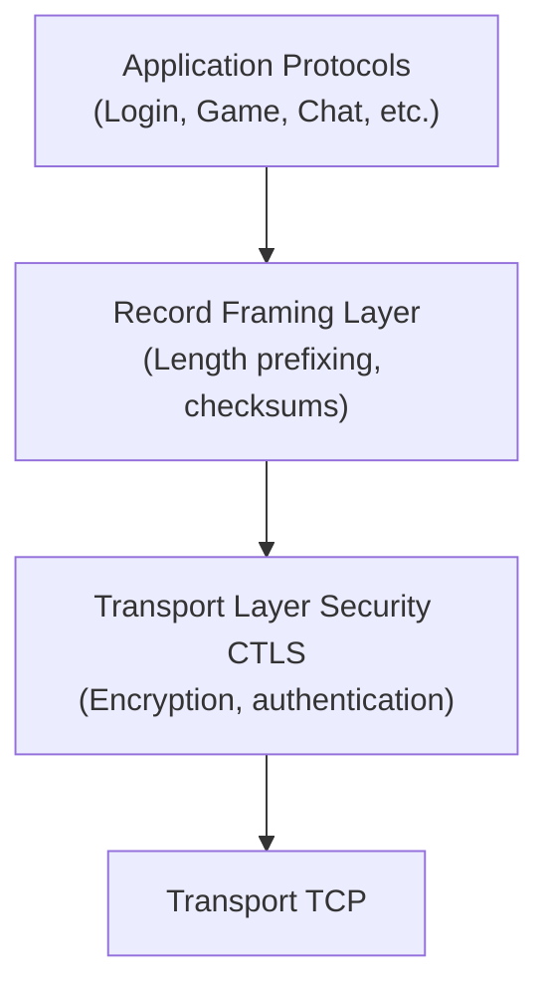
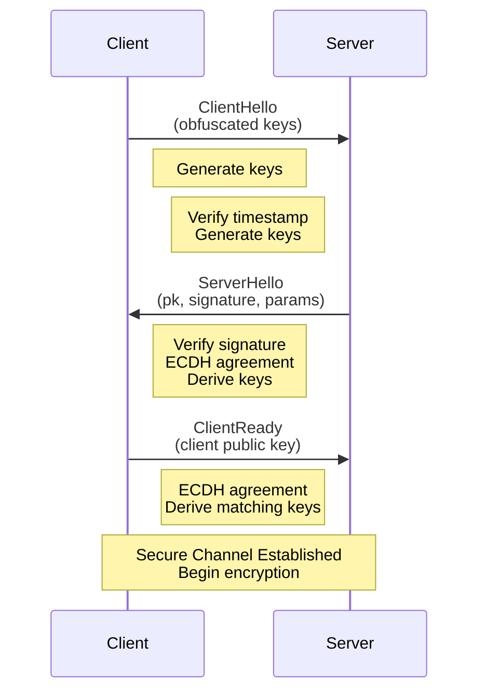

# PokéMMO Specifications

⚠️ **DISCLAIMER:** This is a work-in-progress reverse-engineered protocols documentation. This project is **NOT affiliated with PokéMMO** or its developers. This is for educational and research purposes only.

**Status:** Work in Progress

## Abstract

This document specifies the PokéMMO network protocols, including the Custom Transport Layer Security (CTLS) Protocol and application-level protocols (Login, Game, and Chat). CTLS provides confidentiality and authentication services through the use of Elliptic Curve Diffie-Hellman (ECDH) key exchange, Elliptic Curve Digital Signature Algorithm (ECDSA) authentication, and Advanced Encryption Standard in Counter mode (AES-CTR).

Unlike standard [TLS (RFC5246)](https://www.rfc-editor.org/info/rfc5246), CTLS is a simplified custom implementation. The application protocols operate over CTLS-secured connections and are currently being documented.

## Table of Contents

1. [Introduction](#introduction)
2. [Protocol Overview](#protocol-overview)
3. [Cryptographic Components](#cryptographic-components)
4. [Handshake Protocol](#handshake-protocol)
5. [Packet Structure](#packet-structure)
6. [Key Derivation](#key-derivation)
7. [Record Protocol](#record-protocol)
8. [Application Protocols](#application-protocols)

## Introduction

This specification documents the complete PokéMMO network protocol stack, including the transport security layer (CTLS) and application protocols.

The Custom Transport Layer Security (CTLS) Protocol establishes secure channels between client and server, providing server authentication, integrity protection, and confidentiality. It employs public key cryptography for server authentication and secret key cryptography for data protection.

CTLS consists of two phases:

- **Handshake Protocol** — Establishes server authentication, shared secrets, and cipher parameters.
- **Record Protocol** — Uses the negotiated keys and parameters to protect transmitted data.

Multiple application protocols (Login, Game, Chat) operate over separate CTLS-secured TCP connections.

## Protocol Overview

### Protocol Architecture

The PokéMMO protocol stack operates as follows:



The CTLS protocol operates at the transport layer, providing secure communication channels. Multiple TCP connections may be established, each running CTLS and supporting different application protocols.

### Handshake Process

The handshake protocol consists of three messages:

1. **ClientHello (0x00)** — Client initiates connection
2. **ServerHello (0x01)** — Server responds with public key and signature
3. **ClientReady (0x02)** — Client confirms with its public key

## Cryptographic Components

### Elliptic Curve

secp256r1 (P-256), 256-bit key size with uncompressed point format (65 bytes).

### Digital Signatures

ECDSA with SHA-256.

### Key Agreement

Elliptic Curve Diffie-Hellman (ECDH).

### Symmetric Encryption

AES in Counter (CTR) mode.

### Integrity Protection

- HMAC-SHA256
- CRC16

The checksum algorithm and size are negotiated during the ServerHello message.

## Handshake Protocol

### ClientHello

**Opcode:** 0x00

Initiates the TLS handshake with replay attack protection.

**Fields:**
- **Obfuscated Random Key** (8 bytes) — Random value XOR'd with predefined key1 constant
- **Obfuscated Timestamp** (8 bytes) — Client timestamp XOR'd with key2 and random key

**Structure:**
```c
struct ClientHello {
    int64_t obfuscated_random_key;
    int64_t obfuscated_timestamp;
};
```

### ServerHello

**Opcode:** 0x01

Contains the server's public key, authentication signature, and checksum algorithm.

**Fields:**
- **Public Key Length** (2 bytes, LE) — Length of the public key data (typically 65 bytes)
- **Server Public Key** (variable) — ECDSA public key in uncompressed point format (0x04 + X + Y coordinates)
- **Signature Length** (2 bytes, LE) — Length of the ECDSA signature (typically 64 bytes)
- **ECDSA Signature** (variable) — Digital signature of the public key using server's root private key
- **Checksum Size** (1 byte) — Size of checksums for subsequent packets (16 for HMAC-SHA256)

**Structure:**
```c
struct ServerHello {
    int16_t public_key_length;
    uint8_t  server_public_key[public_key_length];
    int16_t signature_length;
    uint8_t  ecdsa_signature[signature_length];
    int8_t  checksum_size;
};
```

### ClientReady

**Opcode:** 0x02

Completes the handshake by providing the client's public key.

**Fields:**
- **Public Key Length** (2 bytes, LE) — Length of the client's public key data (typically 65 bytes)
- **Client Public Key** (variable) — Client's ECDSA public key in uncompressed point format

**Structure:**
```c
struct ClientReady {
    int16_t public_key_length;
    uint8_t  client_public_key[public_key_length];
};
```

### State Machine

Both client and server follow this state machine:



## Packet Structure

Length-prefixed format for all packets.

Handshake phase: unencrypted
Secure phase: encrypted and checksummed

## Key Derivation

Shared secret is derived using ECDH. Symmetric keys and initialization vectors are derived from the shared secret using triple-hash with SHA-256.

## Record Protocol

All packets are prefixed with a length field.

During handshake: `Length Prefix || Packet Data` (unencrypted)

After handshake: `Length Prefix || Encrypted Data || Checksum`

## Application Protocols

The PokéMMO system uses three main application protocols, each operating over its own dedicated TCP connection with the CTLS security layer.

**Status:** Work in progress

### Login Protocol

Documentation in progress.

### Game Protocol

Documentation in progress.

### Chat Protocol

Documentation in progress.